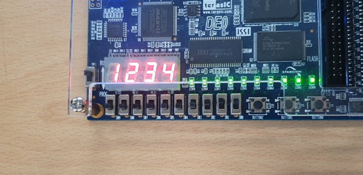

# MIPS 프로세서 디자인

![language-verilog-hdl][language-verilog-hdl]
 
![participants-solo][participants-solo]
 
[![institution-korea-university][korea-university-image]][korea-university-cs-url]
![course-computer-architecture][course-cose222]
![grade-b+][grade-b+]

> Verilog HDL로 디자인한 교육용 MIPS 보드에서 작동하는 간단한 프로세서입니다.

### 스크린샷

### 작업 기간

2019년 하반기

### 라이선스 및 공동체 수정

이곳은 개인 프로젝트 백업을 목적으로 하는 저장소입니다.

  * 모든 제3자 사용을 허가하지 않습니다.
  * 모든 제3자 수정을 승인하지 않습니다.
    * 깃허브 Pull Request를 받지 않습니다.

<!-- Image definitions -->
[korea-university-image]: https://img.shields.io/badge/Institution-Korea%20University-red
[korea-university-cs-url]: http://cs.korea.ac.kr
[course-cose222]: https://img.shields.io/badge/Course-Computer%20Architecture-brightgreen
[language-verilog-hdl]: https://img.shields.io/badge/Language-Verilog%20HDL-orange
[grade-b+]: https://img.shields.io/badge/Grade-B%2B-yellow
[participants-solo]: https://img.shields.io/badge/Participants-Solo%20Project-7aa3cc
